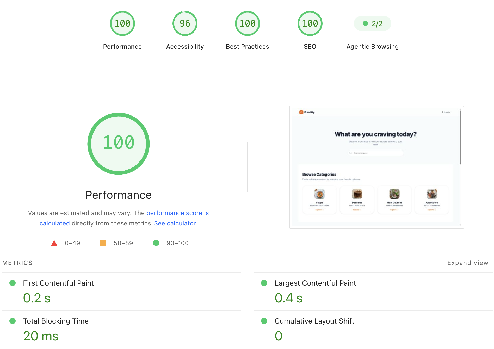

# Freshify 🍲✨

**Freshify** is a modern recipe-sharing platform where food lovers can discover, share, and curate their own culinary masterpieces. Built for performance and user experience, this platform provides a seamless digital kitchen for aspiring chefs and food enthusiasts alike.

## 🚀 Live Demo
[https://getfreshify.vercel.app/](https://getfreshify.vercel.app/)

---

## 🛠 Tech Stack

Built with a modern, robust, and scalable full-stack architecture:

* ⚙️ **Framework:** [Next.js 16](https://nextjs.org/) (App Router) - Fast, SEO-friendly architecture.
* 💻 **Core:** [TypeScript](https://www.typescriptlang.org/) - Enhanced type safety and robust, maintainable code.
* 🎨 **Styling:** [Tailwind CSS](https://tailwindcss.com/) - Modern, responsive, and aesthetic UI.
* 🗄️ **Database:** [PostgreSQL](https://www.postgresql.org/) (hosted on [Neon](https://neon.tech/)) - Reliable and scalable database solution.
* 🔍 **ORM:** [Prisma](https://www.prisma.io/) - Efficient and type-safe database interactions.
* 🔐 **Authentication:** [NextAuth.js](https://next-auth.js.org/) - Secure session management.
* 💾 **Storage:** [Vercel Blob](https://vercel.com/docs/storage/vercel-blob) - Efficient handling of recipe cover images and media.
* 🚀 **Deployment:** Hosted on [Vercel](https://vercel.com/).

---

## ✨ Features

* **Recipe Discovery:** Browse through categories and featured recipes.
* **Interactive Kitchen:** Create and share your own recipes with images.
* **Authentication:** Secure sign-in and user profile management.
* **Responsive Design:** Optimized for mobile, tablet, and desktop devices.
* **Performance Focused:** Leveraging the latest Next.js features for speed and efficiency.

---

## ⚡ Performance & Optimization

Freshify has been engineered for top-tier performance, achieving a perfect **100/100 Lighthouse Performance score**. The application is optimized for speed, accessibility, and SEO, ensuring a seamless user experience.

### Key Metrics

| Metric | Score / Value |
| :--- | :---: |
| **Performance** | 100 |
| **Accessibility** | 96 |
| **Best Practices** | 100 |
| **SEO** | 100 |

### Highlights

* **First Contentful Paint:** 0.2s 🚀
* **Largest Contentful Paint:** 0.4s ✨
* **Cumulative Layout Shift:** 0 🎯
* **Total Blocking Time:** 20ms ⏱️

> *All metrics are audited with Google PageSpeed Insights, ensuring professional-grade web standards.*

